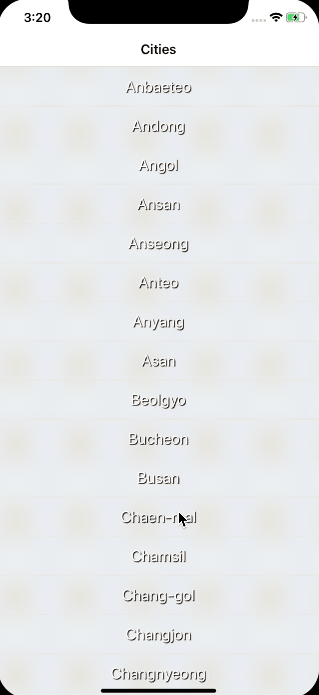

# 실전코딩 13주차 과
> 201704147 이용재

> 201702063 이지현

> 201702019 박채연

## Goal
- 날씨 앱을 보다 나은 UX와 환경을 갖추도록 구성

## Result

## What I learn
- 어플 진입시 아이콘 설정
- 초기 화면을 좀 더 이쁘게 보이도록 꾸민
- 각 지역을 클릭해서 들어가게 될 경우
  - 5일치의 데이터를 json 형식으로 받을 수 있게함
  - 이를 바탕으로 d3를 사용해서 그래프로 시각화 하였음
  - 슬라이드로 각 해당 x축에 대한 데이터를 실시간으로 갱신할 수 있도록 함
  - 슬라이드 아래 갱신할 수 있는 온도, 습도, 현재 기후상태를 알 수 있도록 함
  - 지도를 넣음
